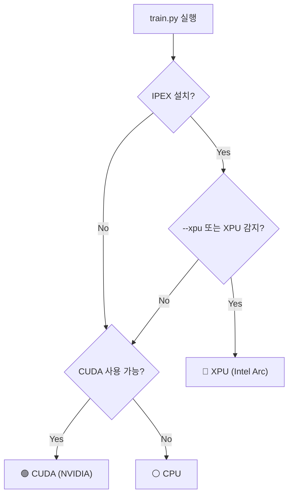

# Intel Arc GPU 학습 셋업 가이드

Intel Arc GPU에서 HoloScope 학습을 실행하기 위한 완전한 설치 가이드입니다.

---

## 지원 환경

| 항목 | 요구사항 |
|------|---------|
| **OS** | Ubuntu 22.04 / 24.04 LTS (권장) |
| **WSL2** | Windows 11 + WSL2 Ubuntu 22.04 (부분 지원) |
| **GPU** | Intel Arc A-Series (A380, A580, A750, A770) |
| **드라이버** | Intel compute-runtime ≥ 24.x |
| **Python** | 3.11 |
| **IPEX** | intel-extension-for-pytorch ≥ 2.3.0 |

> **macOS 비지원**: Intel Arc XPU는 Linux 전용입니다. macOS에서는 `--cpu` 플래그를 사용하거나 CUDA GPU 환경에서 실행하세요.

---

## 1단계: Intel GPU 드라이버 설치 (Ubuntu)

```bash
# Intel GPU 저장소 키 등록
wget -qO- https://repositories.intel.com/gpu/intel-graphics.key \
  | sudo gpg --yes --dearmor --output /usr/share/keyrings/intel-graphics.gpg

# 저장소 추가 (Ubuntu 22.04 기준)
echo "deb [arch=amd64,i386 signed-by=/usr/share/keyrings/intel-graphics.gpg] \
  https://repositories.intel.com/gpu/ubuntu jammy unified" \
  | sudo tee /etc/apt/sources.list.d/intel-graphics.list

# 패키지 업데이트 및 설치
sudo apt update
sudo apt install -y \
  intel-opencl-icd \
  intel-level-zero-gpu \
  level-zero \
  level-zero-dev \
  intel-media-va-driver-non-free \
  libmfx1 libmfxgen1 libvpl2

# 현재 사용자를 render 그룹에 추가 (재로그인 필요)
sudo usermod -aG render $USER
sudo usermod -aG video $USER
newgrp render
```

### 드라이버 설치 확인

```bash
# Level Zero 장치 목록 확인
ls /dev/dri/render*
# → /dev/dri/renderD128  (Arc GPU 감지됨)

# GPU 정보 확인 (clinfo 방식)
sudo apt install -y clinfo && clinfo | grep "Device Name"
# → Intel(R) Arc(TM) A770 Graphics

# Level Zero 확인
sudo apt install -y level-zero-dev && \
  python3 -c "import ctypes; ctypes.CDLL('libze_loader.so.1'); print('Level Zero OK')"
```

---

## 2단계: IPEX (Intel Extension for PyTorch) 설치

IPEX는 Intel Arc XPU 백엔드를 PyTorch에 추가합니다.

```bash
# 프로젝트 루트로 이동
cd /path/to/anihoin

# uv로 arc 의존성 설치
uv sync --extra arc

# 설치 확인
uv run python -c "
import torch
import intel_extension_for_pytorch as ipex
print(f'PyTorch: {torch.__version__}')
print(f'IPEX:    {ipex.__version__}')
print(f'XPU 사용 가능: {torch.xpu.is_available()}')
if torch.xpu.is_available():
    print(f'XPU 장치:      {torch.xpu.get_device_name(0)}')
"
```

**정상 출력 예시:**
```
PyTorch: 2.3.0+xpu
IPEX:    2.3.0+xpu
XPU 사용 가능: True
XPU 장치:      Intel Arc A770 Graphics
```

---

## 3단계: 환경 변수 설정

학습 안정성과 성능을 위해 아래 변수를 설정합니다.

```bash
# ~/.bashrc 또는 ~/.zshrc 에 추가
cat >> ~/.bashrc << 'EOF'

# ── Intel Arc GPU 학습 환경 ──────────────────────────────
# SYCL 캐시 영구 저장 (재컴파일 방지)
export SYCL_CACHE_PERSISTENT=1

# SysMan API 활성화 (GPU 모니터링)
export ZES_ENABLE_SYSMAN=1

# XPU 선택 (멀티 GPU 시 장치 인덱스 지정, 단일 GPU는 생략 가능)
# export ONEAPI_DEVICE_SELECTOR=level_zero:0

# FP64 에뮬레이션 비활성화 (Arc는 FP64 HW 미지원, 경고 억제)
export IPEX_FP64_EMULATE=0

# oneCCL 통신 백엔드 (단일 GPU 학습 시 불필요)
# export CCL_WORKER_COUNT=1
EOF

source ~/.bashrc
```

---

## 4단계: 학습 실행

### 단독 실행

```bash
# Intel Arc XPU 가속 학습
uv run python train.py \
  --xpu \
  --data-dir  ./dataset/raw \
  --save-dir  ./checkpoints \
  --batch-size 32 \
  --phase1-epochs 5 \
  --phase2-epochs 30

# 특정 XPU 장치 지정 (멀티 GPU)
uv run python train.py \
  --device xpu:1 \
  --batch-size 32 \
  --phase1-epochs 5 \
  --phase2-epochs 30
```

### 파이프라인 실행

```bash
# 크롤링 + Arc XPU 학습 + 릴리즈
bash pipeline/run_pipeline.sh \
  --version v3.0.0 \
  --xpu \
  --release

# 기존 데이터로 Arc XPU 학습만
bash pipeline/run_pipeline.sh \
  --version v3.0.0 \
  --skip-crawl \
  --xpu
```

### 배치 크기 권장값

| GPU | VRAM | 권장 batch-size |
|-----|------|----------------|
| Arc A380 | 6 GB | 16 |
| Arc A580 | 8 GB | 24 |
| Arc A750 | 8 GB | 24 |
| Arc A770 | 16 GB | 48~64 |

---

## 5단계: GPU 모니터링

```bash
# Intel GPU 모니터 (내장 도구)
sudo apt install -y intel-gpu-tools
sudo intel_gpu_top

# 또는 Python으로 XPU 메모리 확인
uv run python -c "
import torch
import intel_extension_for_pytorch as ipex
t = torch.randn(1000, 1000).to('xpu')
print(f'할당된 메모리: {torch.xpu.memory_allocated() / 1e6:.1f} MB')
print(f'예약된 메모리: {torch.xpu.memory_reserved() / 1e6:.1f} MB')
"
```

---

## 트러블슈팅

### ❌ `torch.xpu.is_available()` → `False`

```bash
# 원인 1: render 그룹 미적용
groups $USER  # render 포함 여부 확인
newgrp render && source ~/.bashrc

# 원인 2: IPEX 미설치
uv sync --extra arc

# 원인 3: 드라이버 미설치
ls /dev/dri/render*  # 없으면 드라이버 재설치
```

### ❌ `RuntimeError: XPU 사용 불가` during `--xpu`

```bash
# 방법 1: XPU 강제 플래그 제거 후 자동 감지
uv run python train.py  # --xpu 없이 실행, 자동으로 xpu → cuda → cpu 시도

# 방법 2: CPU 폴백
uv run python train.py --cpu
```

### ❌ BFloat16 / FP16 오류

Arc GPU는 **BFloat16(bf16)** 을 네이티브 지원합니다. FP16은 소프트웨어 에뮬레이션입니다.
IPEX optimize()는 기본적으로 `dtype=torch.bfloat16`을 사용하므로 별도 설정 불필요합니다.

```bash
# bf16으로 강제 실행 (AMP 활성화)
uv run python train.py --xpu

# AMP 비활성화 (FP32, 느림)
uv run python train.py --xpu --no-amp
```

### ❌ WSL2 환경에서 XPU 미감지

WSL2는 Intel Arc GPU를 제한적으로 지원합니다.

```bash
# WSL2에서 GPU 패스스루 확인
ls /dev/dri/  # renderD128 필요

# WSL2 Intel GPU 지원 드라이버 (별도 설치 필요)
# https://github.com/intel/intel-extension-for-pytorch/blob/main/docs/tutorials/installation.md
```

---

## IPEX 없이도 기존 기능 유지

IPEX가 설치되지 않은 환경(예: macOS, NVIDIA CUDA 서버)에서는 기존 동작이 그대로 유지됩니다.



| 상황 | 디바이스 | 명령 |
|------|---------|------|
| Intel Arc (uv sync --extra arc) | XPU | `--xpu` 또는 자동 |
| NVIDIA GPU | CUDA | 자동 |
| CPU 폴백 | CPU | `--cpu` |
